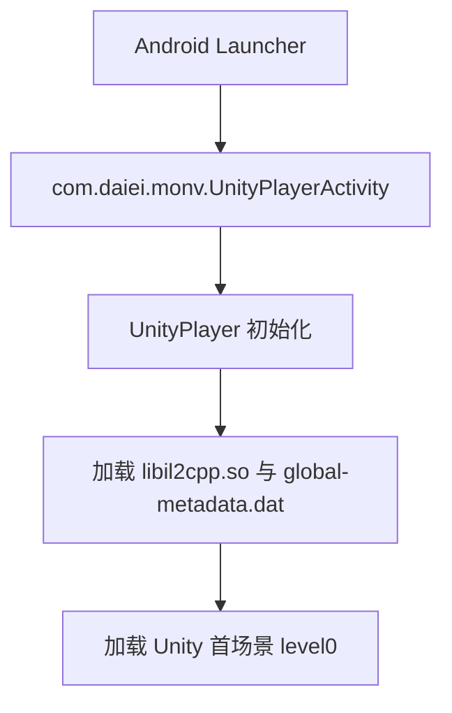
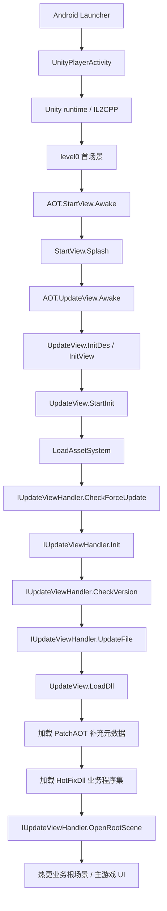

# shaonv 反编译源码界面与启动顺序分析

分析时间：2026-05-22  
分析目录：`D:\work\openclaw-workspace\arpg\shaonv`  
结论范围：仅基于本目录 `resources` 与本次生成的 `reverse-output`，不复用相邻目录的旧反编译结果。

## 结论摘要

本目录 APK/Unity 工程的主业务代码没有直接出现在 IL2CPP 元数据导出的类型表中。`dump.cs` 里可以确认启动壳、更新界面、HybridCLR 热更加载器、YooAsset 资源系统入口，但没有 `Assembly-CSharp.dll` 的业务类型，也没有 `UIManager`、`UIPopup_*`、`UILobby`、`UITutorial_*` 等主游戏 UI 类。

因此，当前可以可靠整理的是：

1. Android 到 Unity 的入口顺序。
2. AOT 启动壳界面：`StartView`、`AOT.UpdateView`。
3. 启动更新、资源系统初始化、热更 DLL 加载、打开根场景的流程。
4. 第三方 SDK 原生 Activity 列表。

当前不能可靠列完整的是：

1. 主游戏所有 UI 界面、弹窗、教程界面、战斗 HUD。
2. 登录后大厅、编队、抽卡、背包、关卡、战斗等业务界面顺序。
3. 主游戏状态机与界面管理器。

这些内容应在解出 HybridCLR 热更程序集和 YooAsset 资源映射后继续分析。

## 输入文件

| 文件 | 作用 | 备注 |
| --- | --- | --- |
| `resources\AndroidManifest.xml` | Android 启动入口和原生 Activity | package 为 `com.and.gt.snhl`，versionName 为 `1.18` |
| `resources\lib\arm64-v8a\libil2cpp.so` | IL2CPP native 代码 | 本次用于 Il2CppDumper |
| `resources\assets\bin\Data\Managed\Metadata\global-metadata.dat` | IL2CPP 元数据 | Metadata Version 31 |
| `resources\assets\bin\Data\level0` | Unity 首场景数据 | 很小，推断为启动壳/更新场景 |
| `resources\assets\bin\Data\sharedassets0.assets` | Unity 共享资源 | 很小，主要配合首场景 |
| `resources\assets\asd\YooAsset` | YooAsset 相关程序集/数据 | 二进制字符串包含 YooAsset 资源加载逻辑 |
| `resources\assets\yoo\Default\*.bundle` | YooAsset 包体 | 327 个文件，常规 AssetStudio 直接解析为 0 个资产 |

## Android 启动入口

`AndroidManifest.xml` 中确认：

| 项 | 值 |
| --- | --- |
| package | `com.and.gt.snhl` |
| versionName | `1.18` |
| 主 Activity | `com.daiei.monv.UnityPlayerActivity` |
| 屏幕方向 | `userLandscape` |
| Launcher category | `android.intent.category.LAUNCHER`、`android.intent.category.LEANBACK_LAUNCHER` |
| MAIN action | `android.intent.action.MAIN` |
| Unity 标记 | `unityplayer.UnityActivity=true` |

启动顺序第一段：



## AOT/Unity 程序集结构

本次从 shaonv 目录导出的 `dump.cs` 顶部 Image 列表显示存在：

| Image | 说明 |
| --- | --- |
| `Assembly-CSharp-firstpass.dll` | AOT 中可见的 firstpass 代码 |
| `AOTEnter.dll` | 启动壳、更新流程、热更加载入口 |
| `HybridCLR.Runtime.dll` | HybridCLR 补充元数据加载 |
| `UniTask.dll` | 异步启动流程 |
| `YooAsset` 相关字符串/逻辑 | 资源包初始化、下载、加载 |
| `UniWebView-CSharp.dll` | WebView/登录授权能力 |
| `IngameDebugConsole.Runtime.dll` | 调试控制台 UI |
| `UnityEngine.UI.dll`、`Unity.TextMeshPro.dll` | UI 基础库 |

没有出现在 Image 列表中的关键程序集：

| 缺失项 | 影响 |
| --- | --- |
| `Assembly-CSharp.dll` | 主业务逻辑不在 AOT 类型表里 |
| `WorldMap.dll` | 只在字符串中出现，类型未导出 |

`stringliteral.json` 中可见 `Assembly-CSharp.dll`、`WorldMap.dll`、`HotFixDll`、`PatchAOT`，说明它们更可能是热更加载目标，而不是已静态编译进 IL2CPP 的类型。

## 已确认启动壳界面

### `AOT.StartView`

位置：`dump.cs` 中 `public class StartView : MonoBehaviour`。

字段：

| 字段 | 类型 | 含义 |
| --- | --- | --- |
| `splashList` | `CanvasGroup[]` | 启动闪屏列表 |
| `showTime` | `float` | 单张展示时间 |
| `fadeTime` | `float` | 淡入淡出时间 |

方法：

| 方法 | 含义 |
| --- | --- |
| `Awake()` | 启动时初始化 |
| `Splash()` | 异步播放 splash |

界面定位：应用最早期的启动/品牌闪屏，不是主游戏业务界面。

### `AOT.UpdateView`

位置：`dump.cs` 中 `public class UpdateView : MonoBehaviour`。

字段可还原出该界面的组成：

| 字段 | 类型 | 界面含义 |
| --- | --- | --- |
| `txtTip` | `Text` | 当前状态提示 |
| `sldSpeed` | `Slider` | 加载/更新进度条 |
| `txtApp` | `Text` | 应用版本/信息文本 |
| `btnFix` | `Button` | 修复游戏入口 |
| `imgMask` | `Image` | 遮罩 |
| `pnlAlter` | `Transform` | 普通提示弹窗 |
| `txtTitle` | `Text` | 普通弹窗标题 |
| `txtMsg` | `Text` | 普通弹窗内容 |
| `btnOk` | `Button` | 普通弹窗确认按钮 |
| `txtOk` | `Text` | 确认按钮文本 |
| `imgFixMask` | `Image` | 修复弹窗遮罩 |
| `pnlFixAlter` | `Transform` | 修复确认弹窗 |
| `txtFixTitle` | `Text` | 修复弹窗标题 |
| `txtFixMsg` | `Text` | 修复弹窗内容 |
| `btnFixYes` | `Button` | 确认修复 |
| `txtFixYes` | `Text` | 确认修复文本 |
| `btnFixNo` | `Button` | 取消修复 |
| `txtFixNo` | `Text` | 取消修复文本 |
| `_updateHandler` | `IUpdateViewHandler` | 热更资源系统处理器 |
| `_des` | `AOTI18NDes` | 启动多语言文案 |

方法可还原启动更新状态：

| 方法 | 含义 |
| --- | --- |
| `Awake()` | 入口生命周期 |
| `InitDes()` | 读取启动多语言配置 |
| `InitView()` | 绑定按钮和初始化 UI |
| `StartInit()` | 开始启动流程 |
| `LoadAssetSystem()` | 加载资源系统 DLL/入口 |
| `CheckForceUpdate()` | 强制更新检测 |
| `InitAssetSystem()` | 初始化 YooAsset/资源系统 |
| `CheckVersion()` | 请求/检查资源版本 |
| `UpdateFile()` | 下载或更新资源文件 |
| `LoadDll()` | 加载补充 AOT 和业务热更 DLL |
| `FixGame()` | 修复资源/游戏文件 |
| `ShowAlter()` | 显示普通提示弹窗 |
| `HideAlter()` | 隐藏普通提示弹窗 |
| `OnLoadProgress()` | 加载进度回调 |
| `OnUpdateProgress()` | 更新进度回调 |
| `ShowForceUpdate()` | 显示强更提示 |
| `HandleFail()` | 启动失败处理 |

界面定位：更新器/启动器 UI。它是当前能从本目录 AOT dump 中确认的核心界面。

## 启动顺序

基于 `StartView`、`UpdateView`、`IUpdateViewHandler`、`HotFixLoader`、`AOTConfig` 字段和方法名，启动顺序可整理为：



需要注意：从 `dump.cs` 只能确认方法和接口，不含方法体细节。上图中的业务根场景名需要从 `AOTConfig.gameStartScene` 的实际资源配置或解出的资源系统 DLL 中继续确认。

## 热更与资源系统证据

### `AOTConfig`

字段显示热更启动配置：

| 字段 | 含义 |
| --- | --- |
| `assetSystemDll` | 资源系统 DLL 名 |
| `assetSystemDllDir` | 资源系统 DLL 目录 |
| `updateHandlerTypeName` | 资源系统入口类型 |
| `loadGameDlls` | 业务代码加载顺序 |
| `pathAOTDlls` | 补充元数据 DLL 列表 |
| `loadGameDllExtension` | 业务 DLL 后缀 |
| `gameStartScene` | 游戏启动场景 |

### `HotFixDllFileUtil` / `HotFixDllPathUtil`

常量显示：

| 常量 | 值 | 含义 |
| --- | --- | --- |
| `DllDir` | `HotFixDll` | 热更业务 DLL 目录 |
| `PatchAOTDllDir` | `PatchAOT` | 补充元数据 DLL 目录 |
| `VersionFile` | `version.bytes` | 热更版本文件 |
| `ZipDir` | `Zip` | 下载压缩包目录 |

### `HotFixLoader`

`LoadHotFixDlls(Action<int,int> onProgress, Action onFinish)` 表示业务程序集是运行期加载的。

### `IUpdateViewHandler`

接口定义：

| 方法 | 含义 |
| --- | --- |
| `CheckForceUpdate<T>(Action<string> onForceUpdate)` | 强更检查 |
| `Init<T>()` | 初始化资源系统 |
| `CheckVersion()` | 检查资源版本 |
| `UpdateFile(Action<float,string> onProgress)` | 更新资源文件 |
| `LoadFile(Action<float,string> onProgress)` | 加载资源/文件 |
| `GetVersion()` | 获取资源/游戏版本 |
| `OpenRootScene()` | 打开热更业务根场景 |

## 当前能列出的界面清单

### 游戏 AOT 启动界面

| 界面/类 | 来源 | 说明 |
| --- | --- | --- |
| `AOT.StartView` | `AOTEnter.dll` | 启动 splash |
| `AOT.UpdateView` | `AOTEnter.dll` | 更新/修复/强更/加载进度界面 |
| `UpdateView.pnlAlter` | `AOT.UpdateView` 字段 | 通用提示弹窗，不是独立类型 |
| `UpdateView.pnlFixAlter` | `AOT.UpdateView` 字段 | 修复确认弹窗，不是独立类型 |

### SDK/原生界面

`AndroidManifest.xml` 中声明了大量第三方原生 Activity。它们不是 Unity 主游戏 UI，但会在登录、支付、WebView、隐私、广告等流程中出现。

| Activity | 用途推断 |
| --- | --- |
| `com.facebook.FacebookActivity` | Facebook 登录/授权 |
| `com.facebook.CustomTabActivity` | 浏览器授权回调 |
| `com.vuplex.webview.HelperActivity` | Vuplex WebView |
| `com.onevcat.uniwebview.UniWebViewProxyActivity` | UniWebView |
| `com.quickgame.android.sdk.activity.AgreementActivity` | 用户协议 |
| `com.quickgame.android.sdk.activity.DMAOptionActivity` | DMA/隐私选项 |
| `com.quickgame.android.sdk.activity.CheckActivity` | SDK 检查页 |
| `com.quickgame.android.sdk.activity.FreeLoginActivity` | 游客/快速登录 |
| `com.quickgame.android.sdk.login.activity.EmailCodeLoginActivity` | 邮箱验证码登录 |
| `com.quickgame.android.sdk.login.HWLoginActivity` | 华为登录 |
| `com.quickgame.android.sdk.switchaccount.SwitchAccountActivity` | 切换账号 |
| `com.quickgame.android.sdk.pay.google.activity.GoogleBillingV5Activity` | Google 支付 V5 |
| `com.quickgame.android.sdk.pay.google.activity.GoogleBillingV4Activity` | Google 支付 V4 |
| `com.quickgame.android.sdk.activity.GuestTipsAfterPayActivity` | 游客支付提示 |
| `com.quickgame.android.sdk.activity.WebActivity` | SDK Web 页面 |
| `com.quickgame.android.sdk.thirdlogin.EpicLoginAct` | Epic 登录 |
| `com.quickgame.android.sdk.user.activity.UserCenterActivity` | 用户中心 |
| `com.quickgame.android.sdk.user.activity.ChangePwdActivity` | 修改密码 |
| `com.quickgame.android.sdk.activity.NoticeActivity` | 公告 |
| `com.quickgame.android.sdk.user.BindEmailActivity` | 绑定邮箱 |
| `com.quickgame.android.sdk.activity.ThirdBindHelpActivity` | 三方绑定帮助 |
| `com.quickgame.android.sdk.user.activity.ThirdUnBindActivity` | 三方解绑 |
| `com.quickgame.android.sdk.user.activity.ThirdBindActivity` | 三方绑定 |
| `com.quickgame.android.sdk.user.activity.TrashAccountActivity` | 注销/删除账号 |
| `com.quickgame.android.sdk.activity.GoogleLoginActivity` | Google 登录 |
| `com.quickgame.android.sdk.login.activity.TTLoginActivity` | TikTok 登录 |
| `com.quickgame.android.sdk.login.activity.PlayGameLoginActivity` | Google Play Games 登录 |
| `com.quickgame.android.sdk.activity.FacebookLoginActivity` | Facebook 登录 |
| `com.quickgame.android.sdk.firebase.NotificationRequestActivity` | 通知权限 |
| `com.quickgame.android.sdk.user.activity.EmailBindChangeActivity` | 修改绑定邮箱 |
| `com.secmtp.sdk.core.activity.ATGdprAuthActivity` | GDPR 授权 |
| `com.secmtp.sdk.core.common.inner.ui.ATLandscapeActivity` | 安全/隐私 SDK 横屏界面 |

### 框架/调试 UI

这些类存在于 AOT dump，但不是游戏业务界面：

| 类 | 来源 | 说明 |
| --- | --- | --- |
| `DebugLogPopup` | `IngameDebugConsole.Runtime.dll` | 调试日志弹窗 |
| `DebugLogRecycledListView` | `IngameDebugConsole.Runtime.dll` | 调试日志列表 |
| `UniWebView*` | `UniWebView-CSharp.dll` | WebView/授权相关 |
| `DropdownField`、`PopupWindow` 等 | `UnityEngine.UIElementsModule.dll` | Unity UIElements 基础控件 |

## 主游戏界面为什么暂不能完整列出

本次在 `dump.cs` 中搜索以下业务 UI/状态类，均未命中：

```text
UIManager
UIPopup
UIPopup_*
UITutorial
UITutorial_*
UILobby
UIOutGame
UIInGame
GameManager
GamePlayManager
GameStep
PlatformLoginManager
```

同时 `DummyDll` 目录中没有 `Assembly-CSharp.dll`，只有 `Assembly-CSharp-firstpass.dll`、`AOTEnter.dll`、`HybridCLR.Runtime.dll` 等 AOT/框架程序集。

这说明主游戏 UI 很可能位于热更 DLL 中，例如 `HotFixDll/Assembly-CSharp.dll`、`WorldMap.dll`。这些 DLL 需要通过游戏自带的 YooAsset 和解密/映射逻辑加载，不能直接从 IL2CPP 元数据枚举。

## AssetStudio 解析结果

对 `resources\assets\yoo\Default` 运行 AssetStudio CLI：

```powershell
..\tools\AssetStudio-net10.0-win\AssetStudio.CLI.exe resources\assets\yoo\Default reverse-output\assets\assetstudio-json --game Normal --export_type JSON --types TextAsset,GameObject,MonoBehaviour --map_op Both --map_type JSON --dummy_dlls reverse-output\il2cpp\il2cppdumper\DummyDll
```

结果：

```text
Found 327 files
Map build successfully !! 0 collisions found
Finished buidling AssetMap with 0 assets.
```

`assets_map.json` 长度为 2，仅为空 JSON。结论：这些 YooAsset 包不能被当前 AssetStudio 常规流程直接识别为明文 Unity 资产，可能存在自定义文件系统、加密、压缩或需要先读取构建目录/Manifest 映射。

## 单机版复刻还需要继续分析什么

要使用这个游戏资源实现单机版，下一阶段应优先补齐：

1. 解出热更 DLL：定位并恢复 `HotFixDll/Assembly-CSharp.dll`、`WorldMap.dll` 等，获取主游戏 UI、状态机、数据模型。
2. 解出 YooAsset manifest：解析 `Default_1001.1774870195.cht.bytes`、`BuildinCatalog.bytes`、`Default.version`，建立资源路径到 bundle hash 的映射。
3. 还原资源解密服务：从 `YooAsset.IDecryptionServices`、AOT 资源系统入口 DLL、`resources\assets\asd\YooAsset` 中找出 bundle 解密/读取逻辑。
4. 反编译热更 DLL 后重新枚举 UI：按类名、prefab 路径、场景引用列出大厅、登录、战斗、养成、弹窗、教程等所有界面。
5. 提取配置表：角色、关卡、技能、掉落、引导、UI 文案、多语言和资源索引。
6. 还原启动根场景：读取 `AOTConfig.gameStartScene` 的实际值，确认 `OpenRootScene()` 进入的场景。
7. 梳理联网依赖：登录、账号、支付、公告、版本检查、战斗结算、背包状态等接口，决定单机替代数据。
8. 建立资源导出流水线：能批量导出 prefab、sprite、texture、spine、音频、特效，并保持原路径/依赖关系。

## 当前建议的后续命令

继续热更/资源解包时，可优先尝试：

```powershell
# 读取文件统一使用 UTF-8，避免中文输出乱码
[Console]::OutputEncoding = [System.Text.Encoding]::UTF8
$OutputEncoding = [System.Text.Encoding]::UTF8
chcp 65001

# 在所有资源中继续找热更路径/入口类/明文 DLL 头
rg -a -n "HotFixDll|PatchAOT|Assembly-CSharp.dll|WorldMap.dll|updateHandlerTypeName|gameStartScene|rawAssembly|___AssemblyString___" resources

# 在本次 IL2CPP dump 中继续定位 AOT 资源系统入口
rg -n "LoadAssetSystem|LoadPatchedAOT|LoadHotFixDlls|IUpdateViewHandler|AOTConfig|GameConfig|UpdateView" reverse-output\il2cpp\il2cppdumper\dump.cs

# 查看 YooAsset 包体数量和大小，优先分析最大包和 catalog/version 文件
Get-ChildItem resources\assets\yoo\Default -File | Sort-Object Length -Descending | Select-Object -First 30 Name,Length
```

