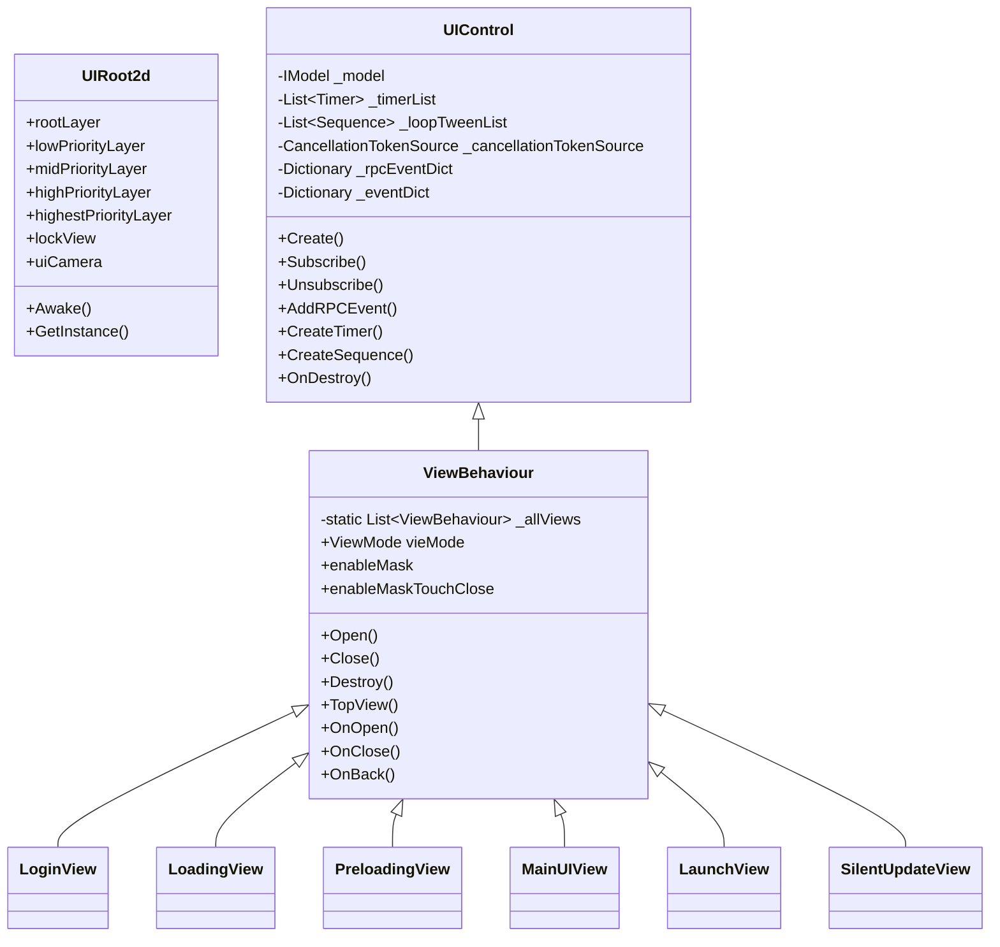

# 少女回战热更业务 UI 调用链与生命周期分析

分析日期：2026-05-22

分析对象：

```text
D:\work\openclaw-workspace\arpg\shaonv\reverse-output\managed\hotfix-dlls\Assembly-CSharp.dll
```

重点类：

```text
UIControl
UIRoot2d
ViewBehaviour
LoginView
LoadingView
PreloadingView
MainUIView
```

补充类：

```text
GameHelper
LaunchView
SilentUpdateView
AssetsService
YooAssetsService
LoginModel
```

## 结论摘要

热更 `Assembly-CSharp.dll` 已经包含业务 UI 的完整逻辑，不是只有绑定壳。核心 UI 框架是：

```text
UIRoot2d             场景内 2D UI 根节点与层级容器
UIControl            MonoBehaviour 基类，统一事件、RPC、Timer、DOTween、CancellationToken 清理
ViewBehaviour        UIControl 子类，统一 Open/Close/Destroy/遮罩/栈顶/返回/BGM
LoginView            登录页业务
LoadingView          登录后转主场景进度页
PreloadingView       Resources 预加载页
MainUIView           MainScene 进入后的主城主界面
LaunchView           启动视频页，播放 launch.mp4，完成后执行传入回调并销毁
SilentUpdateView     静默更新下载进度和奖励领取页
```

已确认的主链路：

```text
Root/启动场景
  -> UIRoot2d.Awake 建立 UI 根节点单例
  -> LaunchView.OnOpen 保存完成回调
  -> LaunchView.Awake 播放 launch.mp4
  -> LaunchView.loopPointReached 回调：m_finish.Invoke(); Destroy()
  -> LoginView.Open/Awake/OnOpen
  -> LoginView 登录按钮：SDK 登录或编辑器账号输入
  -> RPCSession.Connect(server.host, server.port, false)
  -> LoadingView.OnOpen
  -> LoadingView.UpdateProcess 到达 100 后调用 GameHelper.LoadMainScene
  -> GameHelper.LoadMainScene 使用 SceneLoadManagerExtension.LoadAsyncScene 加载 MainScene
  -> MainScene 内或完成回调继续创建/激活 MainUIView
  -> MainUIView.Awake 初始化主界面模块
  -> MainUIView.OnOpen 刷新玩家信息、战力和定时逻辑
  -> MainUIView.OnEnable 触发 CheckGuide 和壁纸自动播放状态
```

其中 `MainUIView` 的具体创建点仍需从 `MainScene.unity`、场景对象或 `SceneLoadManagerExtension.LoadAsyncScene` 完成回调继续验证；本轮热更 IL 已确认 `GameHelper.LoadMainScene` 加载目标场景名为 `MainScene`。

## 类关系



## UIControl 生命周期

`UIControl` 是所有业务 UI 的基础资源管理类。

字段：

```text
_model                   IModel
_timerList               List<Scx.Timer>
_loopTweenList           List<DG.Tweening.Sequence>
_cancellationTokenSource CancellationTokenSource
_rpcEventDict            Dictionary<string, Action<string, RPCData>>
_eventDict               Dictionary<string, List<Action<EventParam>>>
```

关键逻辑：

```text
Init()
  -> _model.Init()

CreateTimer()
  -> new Scx.Timer(...)
  -> Start()
  -> 加入 _timerList

CreateSequence()/CreateLoopSequence()
  -> DOTween.Sequence()
  -> 可设置 loops
  -> 加入 _loopTweenList

Subscribe()/Unsubscribe()
  -> EventCenter.Subscribe/Unsubscribe
  -> 本地 _eventDict 去重和清理

AddRPCEvent()/RemoveRPCEvent()
  -> Prime31.MessageKit<string, RPCData>.addObserver/removeObserver
  -> 本地 _rpcEventDict 记录

OnDestroy()
  -> OnObjDestroy()
  -> _model.Destroy()
  -> StopAllTImer()
  -> KillAllSequence()
  -> 移除所有 RPC observer
  -> 移除所有 EventCenter 订阅
  -> 清空字典
```

单机版复刻时，`UIControl` 应优先保留：

```text
事件中心订阅/反订阅
Timer 生命周期
Tween 生命周期
CancellationToken 或等价取消机制
统一 Destroy 清理
```

RPC 相关可以先替换为本地事件或空实现。

## UIRoot2d 生命周期

字段：

```text
m_s_instance
rootLayer
lowPriorityLayer
midPriorityLayer
highPriorityLayer
highestPriorityLayer
lockView
uiCamera
eventSystem
debugConsole
canvasScaler
```

关键逻辑：

```text
Awake()
  -> 设置静态单例 m_s_instance

GetInstance()
  -> 返回 m_s_instance

ViewBehaviour.Root
  -> UIRoot2d.GetInstance().rootLayer.transform

ShowLockView()/HideLockView()
  -> UIRoot2d.GetInstance().lockView.SetActive(true/false)
```

UI 层级含义：

```text
rootLayer             默认 UI 根
lowPriorityLayer      低优先级层
midPriorityLayer      中优先级层
highPriorityLayer     高优先级层
highestPriorityLayer  最高优先级层
lockView              全局阻塞操作遮罩
```

## ViewBehaviour 生命周期

`ViewBehaviour` 是业务界面的统一打开/关闭框架。

静态字段：

```text
_allViews : List<ViewBehaviour>
```

实例字段：

```text
m_maskBtn
vieMode
enableMask
enableMaskTouchClose
openAction
closeAction
_isClose
maskPrefab
_bgmEffect
```

### Open 流程

`ViewBehaviour.Open(string prefabName, object parameter, bool destroyOther, bool isLock)` 是全局 UI 创建入口。

从 IL 已确认的关键步骤：

```text
Open(prefabName, parameter, destroyOther, isLock)
  -> 可选 Hide/Destroy 其他界面
  -> Resources.Load<GameObject>(prefabName)
  -> Instantiate
  -> 设置 parent 到 ViewBehaviour.Root
  -> 如 enableMask：
       Resources.Load<GameObject>("Prefab/ViewMask")
       创建 "{viewName}MaskPanel"
       Button.onClick += OnMaskTouchEvent
  -> 处理 Screen.safeArea / RectTransform
  -> view.OnOpen(parameter)
  -> 设置 transform.localScale
  -> 可选打开动画
  -> 加入 _allViews
  -> 返回 UniTask<GameObject>
```

遮罩资源：

```text
Prefab/ViewMask
{0}MaskPanel
```

### Start 流程

`ViewBehaviour.Start()` 会派发引导检查事件：

```text
EventCenter.Dispatch("CheckGuide", EventParam.Create<ViewBehaviour>(this))
```

这解释了主界面和其他界面打开后会触发引导系统刷新。

### Close/Destroy 流程

```text
Close(immediate, parameter)
  -> 如 closeAction：播放 DOTween 缩放关闭动画
  -> OnClose()
  -> UIControl.Destroy(immediate, parameter)

Destroy(immediate, parameter)
  -> GetShowFullScreenView()
  -> Show()
  -> TopView()
  -> OnBack(parameter)
  -> PlayBgm()
  -> DestroyMask(immediate)
  -> UIControl.Destroy(immediate, parameter)
```

其他工具方法：

```text
TopView()                 取 _allViews 最顶层
GetView(Type/int)          按类型或索引取界面
Contains(Type)             判断界面是否已打开
DestroyAllView()           销毁全部 ViewBehaviour
DestroyAllMidPriorityView  销毁 midPriorityLayer 下的 ViewBehaviour
OnMaskTouchEvent()         enableMaskTouchClose 时 Close()
```

## LaunchView

字段：

```text
videoPlayer : UnityEngine.Video.VideoPlayer
rawImage    : UnityEngine.UI.RawImage
m_finish    : UnityEngine.Events.UnityAction
```

生命周期：

```text
Awake()
  -> 创建 RenderTexture(1670, 1670, 0)
  -> rawImage.texture = RenderTexture
  -> videoPlayer.targetTexture = RenderTexture
  -> videoPlayer.isLooping = false
  -> videoPlayer.Prepare()
  -> videoPlayer.url = FileUtils.FullPathForFilename("launch.mp4")
  -> videoPlayer.loopPointReached += <Awake>b__3_0
  -> videoPlayer.prepareCompleted += <Awake>b__3_1

OnOpen(parameter)
  -> m_finish = (UnityAction)parameter

prepareCompleted
  -> videoPlayer.Play()
  -> Invoke("ShowRawImage", 0.1)

loopPointReached
  -> m_finish?.Invoke()
  -> Destroy()
```

单机版可将它实现为可跳过的启动视频页；没有视频资源时直接调用完成回调。

## PreloadingView

字段：

```text
processTxt
processSlider
```

流程：

```text
Create()
  -> Resources.Load<GameObject>("Prefab/PreLoadingView")
  -> Instantiate
  -> GameObject.Find("2dUICanvas").transform
  -> SetParent(canvas, false)
  -> GetComponent<PreloadingView>()

SetProcess(value)
  -> processTxt.text = value + "%"
  -> processSlider.value = value
```

这是最早期的 Resources 预加载界面，不依赖 `ViewBehaviour.Open`。

## LoginView

主要字段：

```text
imgBg
pnl
btnLogin
pnlFunction
btnNotice
btnRepair
btnSwitchAccount
btnSelect
pnlVersion
txtVer / txtApp / txtRes
imgLogo
btnAge
txtTipTitle / txtGameTip / txtCopyright
btnServerSel
txtServer / imgServer / txtServerName
imgTipLogin
inputAccount / txtAccount
_loginCoolDown
_richUrl / _richBottom
_togAgree
```

### Awake

```text
Awake()
  -> pnl.Find("@richBottom").GetComponent<HyperlinkText>()
  -> _richBottom.onHrefClick += OnRichBottomClick
  -> pnl.Find("@richUrl").GetComponent<HyperlinkText>()
  -> _richUrl.onHrefClick += OnPrivacyClick
  -> transform.Find("togAgree").GetComponent<Toggle>()
  -> Toggle 初始值来自 PlayerSetting.GetLocalInt("AgreePrivacy")
  -> Toggle.onValueChanged 保存隐私同意状态
  -> btnSelect/btnServerSel 打开 "Prefabs/UI/Login/ServerSelectView"
  -> btnLogin 执行登录逻辑
  -> btnRepair 执行 ShowRepairAlter()
```

登录按钮分支中已确认：

```text
未勾选隐私协议 -> ToastView.Show(Scx.Lang.Get("UI1022010/UI1022013"))
编辑器/特定渠道 -> inputAccount.text -> LoginModel.SaveOpenId()
SDK 渠道 -> LoginModel.SdkLogin(callback)
连接服务器 -> RPCSession.Connect(host, port, false)
埋点 -> SDKService.ConvertStep("8063"/"8066")
```

### OnOpen

```text
OnOpen(parameter)
  -> InitView()
  -> LoginModel.GetOpenId()
  -> inputAccount.text = openId
  -> 根据 SDKService.GetChannel() 决定是否直接 SdkLogin
  -> ReqServerList()
```

### InitView

```text
InitView()
  -> txtVer / txtApp / txtRes 显示版本
  -> GlobalConfig.GetConfig()
  -> AssetsConfig.GetConfig()
  -> AssetsService.GetVersion()
  -> SetStatusImg(...)
  -> imgLogo 做 DOTween 淡入/循环效果
```

### 服务器列表和公告

```text
ReqServerList()
  -> ModelCenter.Get<LoginModel>()
  -> LoginModel.ReqServerList(inputAccount.text, callback)

callback(EnityServer)
  -> 异常时 ShowRequestAlter()
  -> 更新 txtServer/txtServerName/imgServer
  -> SetStatusImg(server status)
  -> ShowAnnounce()

ShowAnnounce()
  -> LoginModel.GetAnnounceInfo(type, OnGetAnnounce)

OnGetAnnounce(announce)
  -> ViewBehaviour.Open("Prefabs/UI/Announce/AnnounceView", announce, ...)
```

隐私和外链：

```text
OnPrivacyClick("privacy")
  -> ViewBehaviour.Open("Prefabs/UI/Common/CommonWebView", ...)

OnRichBottomClick(url)
  -> SDKService.OpenUrl(url)
```

## LoadingView

字段：

```text
PrefabName
imgBg
txtPercent
sldSpeed
_pos
```

生命周期：

```text
Awake()
  -> GameHelper.FixHarmoniousPic(...)
  -> AssetsHelper.LoadSpriteFromBackground(...)
  -> ExtensionMethod.SetSpriteAsync(imgBg, ...)

OnOpen(parameter)
  -> InvokeRepeating("UpdateProcess", ...)

UpdateProcess()
  -> txtPercent.text = "{0}%"
  -> sldSpeed.value = progress
  -> 进度完成后 CancelInvoke("UpdateProcess")
  -> GameHelper.LoadMainScene(callback).Forget()
```

`LoadingView` 是登录成功后进入主场景前的过渡界面。它不直接实例化 `MainUIView`，而是委托 `GameHelper.LoadMainScene`。

## GameHelper.LoadMainScene

状态机 `GameHelper/<LoadMainScene>d__24.MoveNext()` 已确认：

```text
SceneLoadManager.GetInstance()
SceneName = "MainScene"
ProgressCallback = GameHelper/<>c::<LoadMainScene>b__24_0(float)
CompletedCallback = GameHelper/<>c__DisplayClass24_0::<LoadMainScene>b__1()
SceneLoadManagerExtension.LoadAsyncScene(
  sceneLoadManager,
  "MainScene",
  progressCallback,
  completedCallback,
  null,
  LoadSceneMode.Single
)
```

因此主场景切换点明确是：

```text
LoadingView.UpdateProcess
  -> GameHelper.LoadMainScene
  -> SceneLoadManagerExtension.LoadAsyncScene("MainScene")
```

`MainUIView` 的创建可能在以下位置之一：

```text
MainScene.unity 场景对象中已挂载
SceneLoadManagerExtension.LoadAsyncScene 完成回调中打开
MainScene 中某个 MonoBehaviour 的 Awake/Start 打开
```

这部分需要继续导出 `MainScene.unity` 场景 YAML/Prefab 依赖或继续反编译 `SceneLoadManagerExtension` 完成回调。

## MainUIView

主要字段分组：

```text
玩家信息：
pnlPlayerInfo, imgHeadBg, imgExp, txtLevel, txtName, txtPower, btnPlayerInfo

中部/壁纸：
pnlAdapter, btnBodyMask, btnEye, btnChange, _wallpaperPanel, WallpaperRecordSeparator

玩法入口：
pnlFunny, pnlStory, btnHarvest, btnStory, btnArena, btnPrayer,
btnAdventure, btnJumpAutoFight, btnDraw, btnAssist

商业化入口：
pnlCharge, btnActivity, btnWelfare, btnCard, btnCharge, btnShop,
pnlCommercialization, pnlGift

章节任务：
btnChapterInfo, txtChapterTitle, svChapterReward, _chapterRewards

底部栏：
pnlBottom, pnlGal, btnGal, btnHero, btnBagpack, btnPet,
btnDevelop, btnTask, btnLegion

其他：
_topBar, _question, _bHarmonious, listPanel, hidePanels
```

### Awake 初始化顺序

IL 中确认的调用顺序：

```text
Awake()
  -> _bHarmonious = GameHelper.IsHarmonious()
  -> Subscribe("UserSkinChange", ...)
  -> Subscribe("UserSkinInteractiveRoleChange", ...)
  -> Subscribe("RefreshQuestionInfo", UpdateQuestionInfo)
  -> InitPnlPlayerInfo()
  -> InitPnlFunny()
  -> InitPnlTask()
  -> InitPnlBottom()
  -> InitPnlBody()
  -> InitPnlCommercialization()
  -> InitSubscribe()
  -> transform.Find("@TopBar")
  -> GameHelper.InitTopBar(...)
  -> 初始化顶部资源栏 "Prefabs/UI/Common/TopResGrid"
```

### OnOpen

```text
OnOpen(parameter)
  -> base.OnOpen(parameter)
  -> SetUIInfo()
  -> HeroModel.UpdateAllHeroPower(...)
  -> TestTimer().Link(this).Forget()
```

### OnEnable / OnDisable

```text
OnEnable()
  -> CheckGuide().Forget()
  -> ViewBehaviour.TopView()
  -> PlayerSetting.GetBool("WallpaperAutoPlay", ...)
  -> _wallpaperPanel.AutoPlay = ...

OnDisable()
  -> _wallpaperPanel.AutoPlay = false
```

### 主界面模块

```text
InitPnlPlayerInfo()
  -> 玩家信息按钮绑定

InitPnlTask()
  -> 绑定章节任务按钮
  -> Subscribe("RefreshChapterTask", UpdateChapterTask)
  -> Subscribe("GetChapterTaskReward", ...)
  -> Subscribe("ChapterComplete", ...)
  -> 必要时 ReqGetChapterTask.SendData()

InitPnlBottom()
  -> 绑定 Gal/Hero/Bag/Pet/Develop/Task/Legion 等底部入口

InitPnlFunny()
  -> 绑定 Story/Arena/Prayer/Adventure/AutoFight/Draw/Assist 等玩法入口
  -> Subscribe("PauseAutoFight", ...)
  -> Subscribe("ReceiveHookReward", ...)
  -> Subscribe("RefreshHookTime", ...)

InitPnlBody()
  -> 绑定壁纸/角色展示区域
  -> PlayerSetting.GetBool("WallpaperAutoPlay")
  -> WallpaperPanel.Init(...)
  -> WallpaperPanel.UpdateWallpaper(lastPlayed)
  -> 点击可打开 "Prefabs/UI/Wallpaper/WallpaperPreView"

InitPnlCommercialization()
  -> ActivitiesModel.SortAlternates()
  -> AlternatePanel.Init(
       "Prefabs/UI/MainUI/MainUIAlternateGrid",
       "Prefabs/UI/MainUI/MainUIAlternateDot"
     )
  -> transform.Find("@Question")
  -> LimitIconPanel.UpdateGifts(...)

InitSubscribe()
  -> Subscribe("GetFormation", CommonFormationView.GetFormation)
```

红点绑定：

```text
Expedition.Hook.84317
GameShopCollection.Page.1748
Activities.Activity.34064
Activities.Welfare.83923
Activities.ReCharge.99752
Activities.Card.5353
Adventure.AdventureMainView.43704
LotteryDraw.LotteryDrawHero.7805
Arena.ArenaRedDot.89949
Develop.DevelopEnter.78015
Bag.BagRedDot.73517
Quest.QuestEnter.42775
Alliance.AllianceEnter.6965
Remnants.RemnantsEnter.1728
Hero.HeroEnter.30218
LotteryDraw.Prayer.4036
Gal.GalEntry.5799
MainUIView.BtnMenu.84538
ChapterTask.ChapterTaskEnter.32541
```

### SetUIInfo

```text
SetUIInfo()
  -> UserModel.UserLv/UserExp/UserName
  -> UserHelper.GetPlayerExpNeed()
  -> UserHelper.GetPower()
  -> imgExp.fillAmount
  -> txtLevel/txtName/txtPower
  -> ConditionHelper.IsUnlock(...)
  -> UpdateQuestionInfo()
  -> UpdateChapterTask()
  -> UpdateActivitiesBtns()
  -> ExpeditionModel.GetCurStageId()
```

### 返回与隐藏

```text
OnBack(parameter)
  -> ShowOrHide()
  -> SetUIInfo()
  -> PopUpModel.ForcePop/Pop()
  -> RefreshTopBar()
  -> ViewBehaviour.TopView()
  -> 恢复 WallpaperAutoPlay

ShowOrHide()
  -> WallpaperPanel.ActivateCtlBar(...)
  -> hidePanels 取反
  -> listPanel SetActive
  -> TopBar.Hide/Show
  -> UpdateBodyButtonVisible()
```

## SilentUpdateView

字段：

```text
PrefabName
sld
txt
btnClose
svReward
btnGet
_show
```

生命周期：

```text
Awake()
  -> svReward.PrefabName = "Prefabs/UI/Common/RewardGrid"
  -> transform.Find("txt").GetComponent<Text>()
  -> StaticCenter.Get<DataConfigStatic>().GetItem("extra_info")
  -> 解析奖励配置
  -> svReward.ReloadData()
  -> btnGet.AddClickListener(OnGetClick)
  -> 根据 UserModel.DownloadGift 设置按钮文案 UI2049004/UI2049003
  -> CreateTimer 每帧/定时检查 SilentUpdateMgr.IsFinish

OnOpen(parameter)
  -> SilentUpdateMgr.Instance.OnProgress = OnProgress

OnClose()
  -> SilentUpdateMgr.Instance.OnProgress = null

OnProgress(progress, info)
  -> txt.text = info
  -> sld.value = progress

OnGetClick()
  -> 已领取则 Close()
  -> 未领取则 ReqUserDownloadGift.SendData()
```

## 单机版复刻建议

优先还原顺序：

```text
1. UIRoot2d 场景层级和 Canvas
2. UIControl 生命周期清理
3. ViewBehaviour.Open/Close/Destroy 和遮罩
4. LaunchView 可选启动视频
5. PreloadingView 简化资源预加载
6. LoginView 离线账号/服务器选择伪实现
7. LoadingView 进度与 MainScene 切换
8. MainUIView 主界面布局、按钮入口、红点占位、壁纸面板
```

需要替换或模拟的联网依赖：

```text
SDKService
RPCSession
LoginModel.ReqServerList
LoginModel.SdkLogin
LoginModel.GetAnnounceInfo
ReqGetChapterTask
ReqUserDownloadGift
PopUpModel 的远端活动弹窗
SilentUpdateMgr 的真实下载
```

需要继续分析的内容：

```text
1. SceneLoadManagerExtension.LoadAsyncScene 和完成回调，确认 MainUIView 是否由场景或代码创建。
2. MainScene.unity 内的 GameObject/MonoBehaviour 绑定，确认 UIRoot2d、MainUIView、TopBar 的场景挂载关系。
3. Prefabs/UI/Login/LoginView、LoadingView、MainUI/MainUIView 等 prefab 的 Transform 层级和组件绑定。
4. ButtonExtension.AddClickListener 的按钮行为参数，补全 MainUIView 各入口跳转到的 prefab。
5. LoginModel 与 RPCSession 的登录协议字段，决定单机版本地存档结构。
6. EventCenter 全量事件名索引，避免主界面刷新链缺事件。
7. RedDotHelper/ConditionHelper/StaticCenter 数据依赖，决定红点和解锁条件的离线降级策略。
```

## 本轮产物

```text
reverse-output\managed\Assembly-CSharp-ui-callgraph\target-types.csv
reverse-output\managed\Assembly-CSharp-ui-callgraph\target-fields.csv
reverse-output\managed\Assembly-CSharp-ui-callgraph\target-methods.csv
reverse-output\managed\Assembly-CSharp-ui-callgraph\target-calls.csv
reverse-output\managed\Assembly-CSharp-ui-callgraph\target-strings.csv
reverse-output\managed\Assembly-CSharp-ui-callgraph\target-fieldrefs.csv
reverse-output\managed\Assembly-CSharp-ui-callgraph\key-method-calls.csv
reverse-output\managed\Assembly-CSharp-ui-callgraph\UIControl.il.txt
reverse-output\managed\Assembly-CSharp-ui-callgraph\UIRoot2d.il.txt
reverse-output\managed\Assembly-CSharp-ui-callgraph\ViewBehaviour.il.txt
reverse-output\managed\Assembly-CSharp-ui-callgraph\LoginView.il.txt
reverse-output\managed\Assembly-CSharp-ui-callgraph\LoadingView.il.txt
reverse-output\managed\Assembly-CSharp-ui-callgraph\PreloadingView.il.txt
reverse-output\managed\Assembly-CSharp-ui-callgraph\MainUIView.il.txt
reverse-output\managed\Assembly-CSharp-ui-callgraph\GameHelper.LoadMainScene.il.txt
reverse-output\managed\Assembly-CSharp-ui-callgraph\LaunchView.il.txt
reverse-output\managed\Assembly-CSharp-ui-callgraph\SilentUpdateView.il.txt
reverse-output\managed\Assembly-CSharp-startup-callgraph\
```

